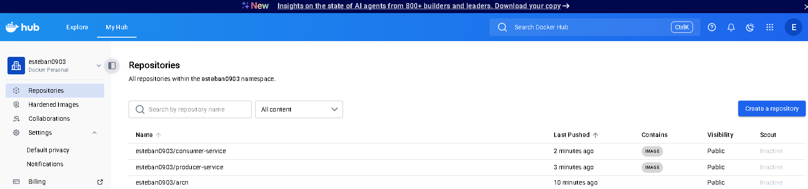
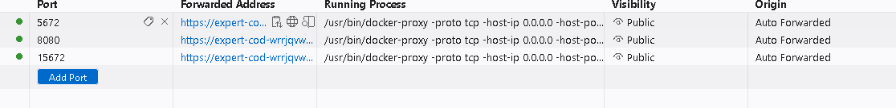
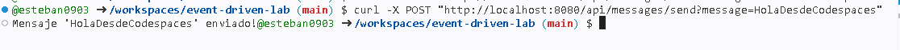

# Laboratorio Event Driven con Spring Boot, RabbitMQ y Docker

## Descripción
Este es un laboratorio simple de eventos usando dos microservicios (Productor y Consumidor) en Spring Boot, RabbitMQ y Docker.

## Estructura
- **producer-service**: expone un endpoint REST para enviar mensajes a RabbitMQ.
- **consumer-service**: escucha la cola y procesa los mensajes recibidos.

## ¿Qué hice?
1. Creé los proyectos Spring Boot para el productor y el consumidor.
2. Configuré RabbitMQ y la comunicación entre ambos servicios.
3. Construí las imágenes Docker y las subí a Docker Hub:
	- esteban0903/producer-service
	- esteban0903/consumer-service
4. Armé el archivo `docker-compose.yml` para levantar todo el entorno.
5. Probé el flujo enviando mensajes y verificando la recepción.

## ¿Cómo lo corro yo?
1. Clona el repo y entra a la carpeta:
	```bash
	git clone https://github.com/esteban0903/event-driven-lab.git
	cd event-driven-lab
	```
2. Levanta los servicios:
	```bash
	docker-compose up -d
	```
3. Envía un mensaje de prueba:
	```bash
	curl -X POST "http://localhost:8080/api/messages/send?message=HolaDesdeCodespaces"
	```
4. Verifica los logs del consumidor:
	```bash
	docker-compose logs consumer
	```


## Imágenes de referencia

### Despliegues en Docker Hub


### Puertos públicos expuestos


### Prueba del endpoint en consola



---

- RabbitMQ UI disponible en el puerto 15672 (usuario/clave: guest/guest)
- Los puertos se exponen automáticamente en Codespaces